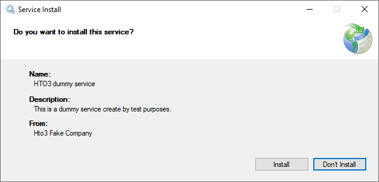
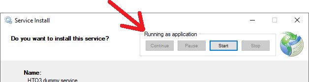



Hto3.WindowsServiceJumpStart
========================================

#### Nuget Package
[](https://www.nuget.org/packages/Hto3.WindowsServiceJumpStart/)

Features
--------
Enable Windows Service projects to be runned as aplication and be auto installable. See below the out-of-box features through a UI:
- Install
- Uninstall
- Run as application (to easily debug your service)
  - Start
  - Stop
  - Pause
  - Continue

<br>

Inspired by the ClickOnce dialog 🐱‍👤

How to use?
-----------
After creating a new Windows Service project in Visual Studio, in your `program.cs` you will get something like it:

```C#
static class Program
{
    /// <summary>
    /// The main entry point for the application.
    /// </summary>
    static void Main()
    {
        ServiceBase[] ServicesToRun;
        ServicesToRun = new ServiceBase[]
        {
            new Service1()
        };
        ServiceBase.Run(ServicesToRun);
    }
}
```

First of all we need to configure our service, you can see all configurations available here. Let's configure the minimun necessary to get it work:

```C#
Runner.Configuration.DisplayName = "HTO3 dummy service";
Runner.Configuration.ServiceName = "HTO3Dummy";
Runner.Configuration.StartType = ServiceStartMode.Automatic;
```

Then we need to change the default engine `ServiceBase.Run()` to the Hto3.WindowsServiceJumpStart engine:

```C#
Runner.Run(ServicesToRun);
```

See below the complete code:

```C#
static class Program
{
    /// <summary>
    /// The main entry point for the application.
    /// </summary>
    static void Main()
    {
        ServiceBase[] ServicesToRun;
        ServicesToRun = new ServiceBase[]
        {
            new Service1()
        };

        //Old way
        //ServiceBase.Run(ServicesToRun);

        Runner.Configuration.DisplayName = "HTO3 dummy service";
        Runner.Configuration.ServiceName = "HTO3Dummy";
        Runner.Configuration.StartType = ServiceStartMode.Automatic;

        Runner.Run(ServicesToRun);
    }
}
```

If you want to enable your service to run as application, just configure it:
```C#
Runner.Configuration.AllowRunningAsApplication = true;
```

And you will get the control panel as below:

